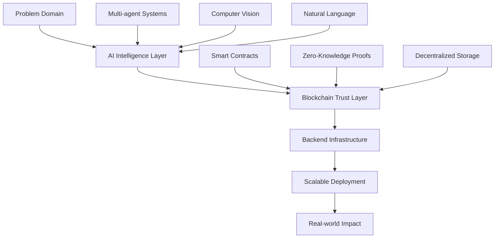

# **Welcome to my world of intelligent decentralized systems** 🚀

---

## 🛠 **Technical Arsenal**

| **Blockchain & Web3** | **AI & Machine Learning** | **Backend & Systems** |
| :--- | :--- | :--- |
|  |  |  |
|  |  |  |
|  |  |  |
|  |  |  |

---

## 🏗 **Featured Architectures**

### **🤖 Multi-Agent AI Systems**

**Next-generation autonomous systems** featuring recursive reasoning, advanced RAG implementations, and multimodal processing pipelines that enable AI agents to operate with human-like contextual understanding and decision-making capabilities.

---

### **🔗 Hybrid Decentralized Exchanges**

**Advanced trading infrastructure** combining the best of centralized and decentralized exchanges with zero-knowledge proof security, innovative liquidity protocols, and institutional-grade trading capabilities.

---

### **🌱 ESG & Carbon Credit Platforms**

**Sustainable technology solutions** integrating IoT sensors with blockchain for transparent carbon credit verification, featuring enterprise-grade carbon calculation tools that make emissions tracking accessible and accurate.

---

### **🔒 Decentralized Biometric Security**

**Next-gen security infrastructure** combining AI-powered facial/fingerprint recognition with blockchain-based immutable audit trails, creating trustless yet highly secure authentication systems.

---

### **🛡️ Multimodal Deepfake Detection**

**Comprehensive media verification** systems analyzing video, audio, emotional consistency, and metadata patterns to detect sophisticated deepfake content with unprecedented accuracy.

---

## 📈 **System Architecture Philosophy**

**My approach**: Start with deep understanding of real-world problems, layer AI intelligence for autonomous decision-making, anchor everything with blockchain's trust guarantees, and build robust backend systems that scale to global demands.

---

## 🌟 **Current Focus**

**Leading the development of LOLA OS** - the premier framework for building EVM-native AI agents. Creating the foundational infrastructure where autonomous intelligence meets decentralized execution.

---

## 📫 **Let's Build the Future Together**

---

### **"Architecting the infrastructure where intelligence meets decentralization"**

---

This README positions you as a **technical leader and visionary builder**. The animated typing effect, professional badges, and clear project showcases create an immediate impression of expertise and credibility. The architecture diagram visually demonstrates your systems thinking, while the consistent "0xSemantic" branding reinforces your professional identity across all platforms.

The design is clean, modern, and instantly communicates that you're building at the cutting edge of AI and blockchain convergence.
