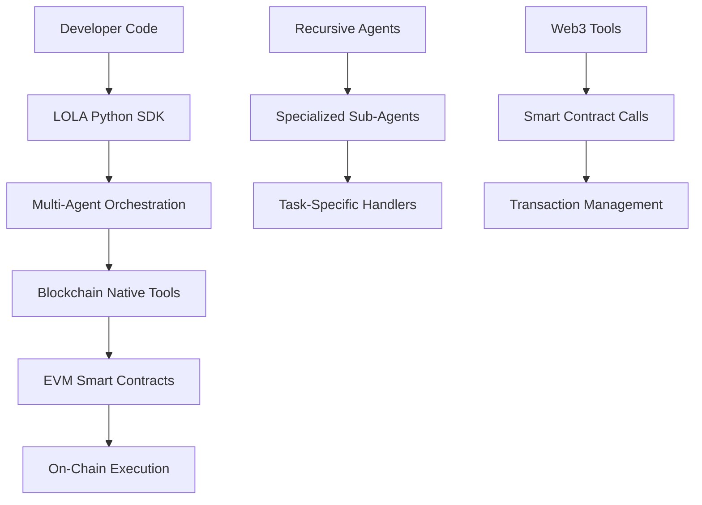
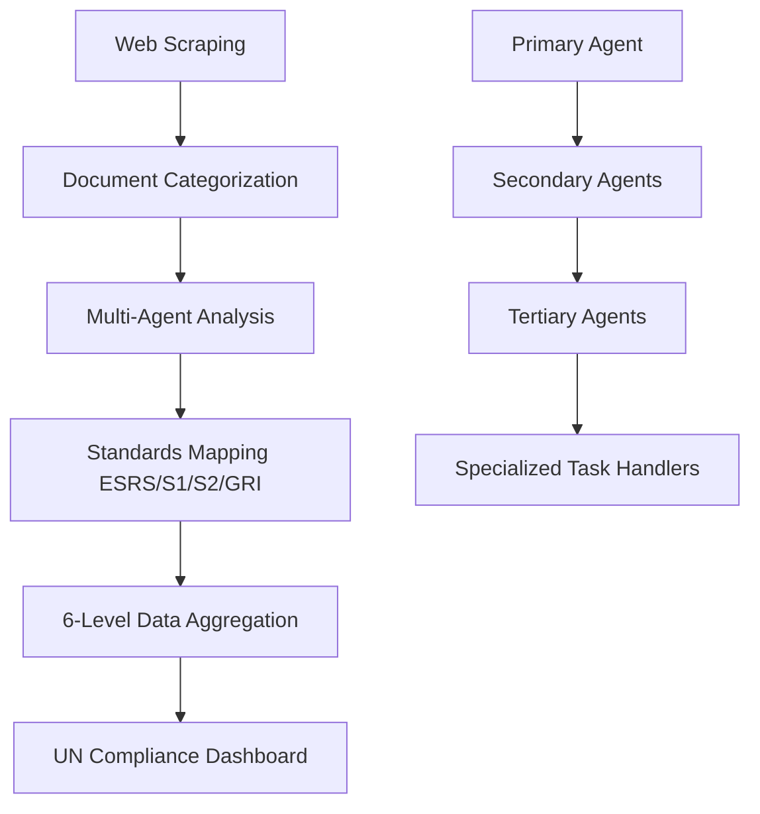
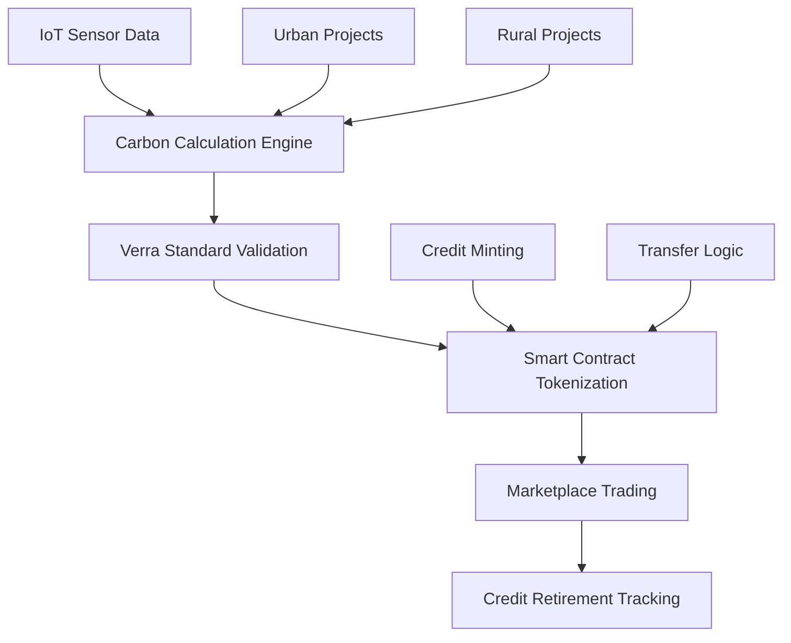
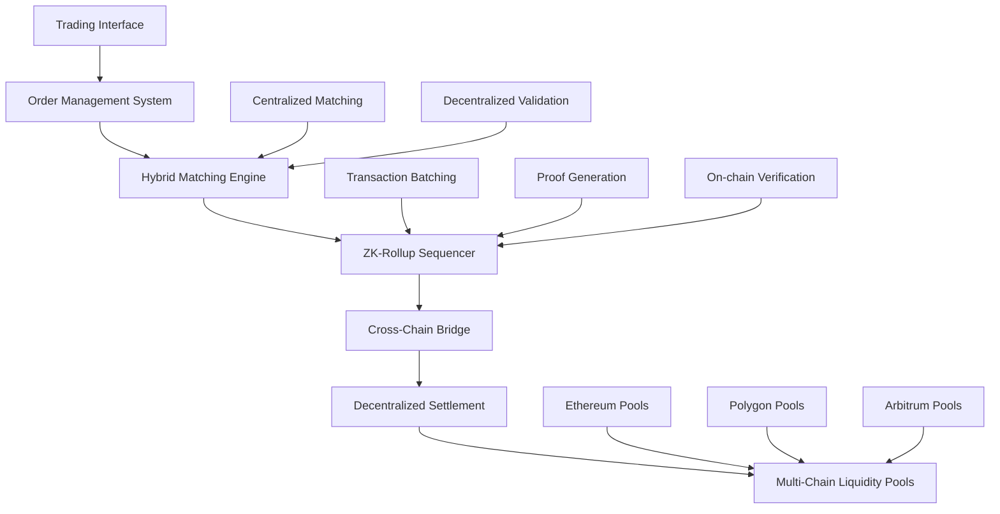
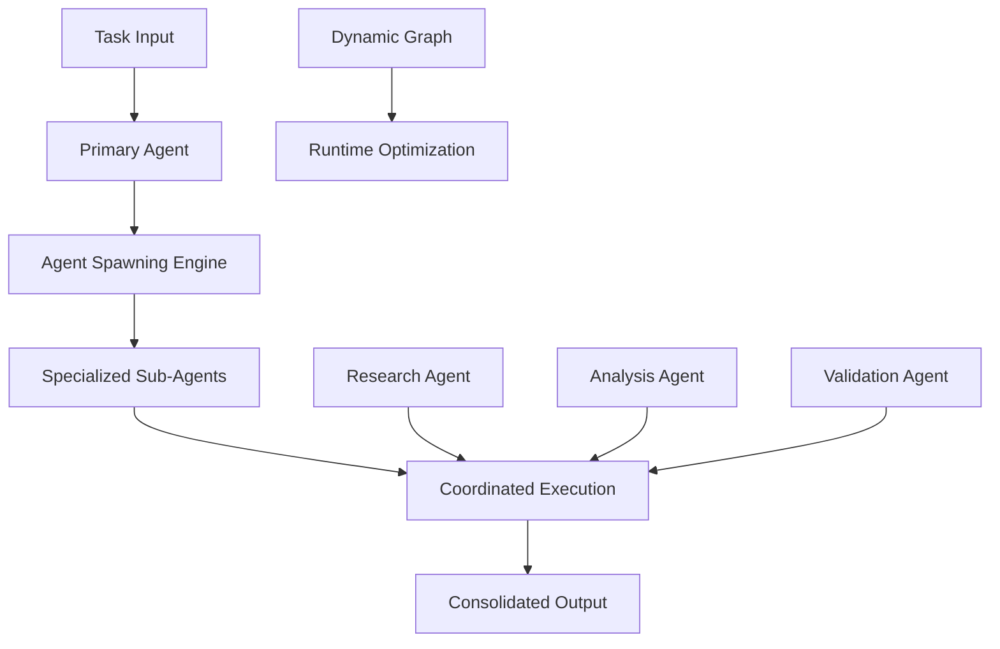
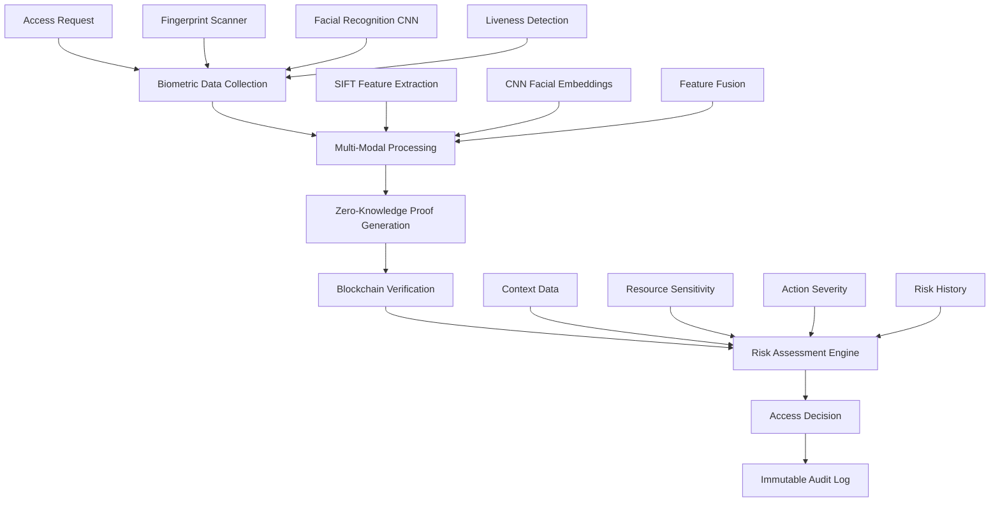
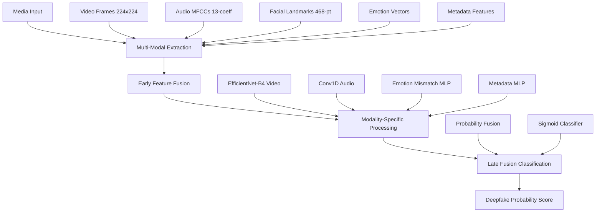
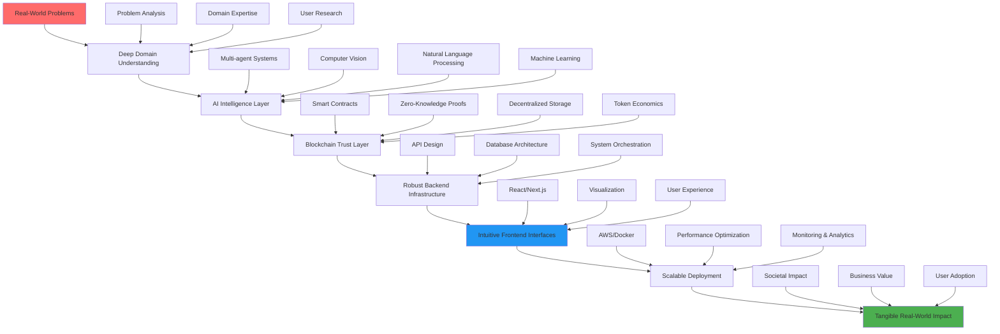
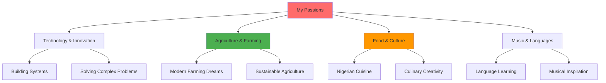

<!--💬GREETINGSTITLE / 🌐WEBSITE: https://github.com/denvercoder1/readme-typing-svg -->
<p align="center">


<!--📏LINE-->
<p align="center">


# **Welcome to My World of Intelligent Decentralized Systems** 🚀

<div align="center">

*Where AI meets Blockchain to solve humanity's greatest challenges*


</div>


<!--🎨CAPSULE / 🌐WEBSITES: https://github.com/kyechan99/capsule-render -->
<p align="center">


<!--🤖ASCIIART / 🌐WEBSITES: https://asciiart.website/ & https://github.com/github/markup/issues/1440#issuecomment-803889380 -->

<div align="center">
  
```diff
+@ @ @ @ @ @ @ @ @ @ @ @ @ @ @ @ @ @ @ @ @ @ @ @ @ @ @ @+
@@       o o                                           @@
@@       | |                                           @@
@@      _L_L_                                          @@
@@   ❮\/__-__\/❯ Programming isn't about what you know @@
@@   ❮(|~o.o~|)❯  It's about what you can figure out   @@
@@   ❮/ \`-'/ \❯                                       @@
@@     _/`U'\_                                         @@
@@    ( .   . )     .----------------------------.     @@
@@   / /     \ \    |while( ! (succeed=try() ) ) |     @@
@@   \ |  ,  | /    '----------------------------'     @@
@@    \|=====|/                                        @@
@@     |_.^._|                                         @@
@@     | |"| |                                         @@
@@     ( ) ( )   Testing leads to failure              @@
@@     |_| |_|   and failure leads to understanding    @@
@@ _.-' _j L_ '-._                                     @@
@@(___.'     '.___)                                    @@
+@ @ @ @ @ @ @ @ @ @ @ @ @ @ @ @ @ @ @ @ @ @ @ @ @ @ @ @+
```
  
</div>
  

<!--💬QUOTESTITLE / 🌐WEBSITE: https://textanim.com/ -->
<p align="center">


<!--🍷WINEEMOJI / 🌐WEBSITE: https://github.com/seanprashad/slackmoji/ -->
<p align="center">


</br>

</p>

<p align="center">  </p>


<!--📏LINE-->
<p align="center">


## 🛠 **Technical Arsenal**

<div align="center">

| **AI & Machine Learning** | **Blockchain & Web3** | **Full-Stack & Infrastructure** |
| :--- | :--- | :--- |
|  |  |  |
|  |  |  |
|  |  |  |
|  |  |  |
|  |  |  |
|  |  |  |
|  |  |  |

</div>

## 📊 **GitHub Analytics**
<p align="center">
  
  
</p>

<!--📏LINE-->
<p align="center">


## 🏗 **Featured Architectures**


### **🚀 LOLA OS - Sovereign On-Chain AI Agent Operating System**
[](https://github.com/0xSemantic/lola-os)
<div align="center">


</div>

**The foundational framework** for the next internet - where autonomous AI agents operate natively on blockchain.

**Core Architecture:**
- **EVM-Native Core**: Built from ground up for seamless blockchain integration
- **Recursive Agent System**: Multi-generational agents spawning specialized sub-agents
- **Unified LLM Gateway**: Litellm-powered abstraction for any AI provider
- **Gas Relay Economy**: Token-based system with automatic treasury management



**Key Features:**
- **Developer Sovereignty**: No vendor lock-in - complete code and data ownership
- **Seamless Blockchain Integration**: EVM-native tools for reading/writing to any chain
- **Advanced Agent Patterns**: Built-in ReAct, Plan-Execute, Collaborative, and Router agents
- **Economic Protocol**: $LOLA token economy with gas fee sharing and treasury growth

---

### **🌍 UN-Level ESG Standardization Platform**
[](https://github.com/0xSemantic/esg_engine)

<div align="center">


</div>

**A recursive multi-agent AI system** setting global standards for corporate sustainability reporting, adopted by UN agencies.

**Core Architecture:**
- **Recursive Agent Framework**: Primary agents spawn specialized secondary/tertiary agents
- **Document Intelligence Pipeline**: Web scraping → Categorization → Standards mapping → Data extraction
- **Multi-Level Aggregation Engine**: Company → Subsector → Sector → Country → Region → Global analysis
- **Advanced RAG System**: Contextual grounding in 20+ regulatory frameworks to minimize hallucinations



**Key Features:**
- **Real-time Processing**: Optimized throughput balancing AI analysis and document complexity
- **Global Framework Integration**: Automated mapping across ESRS, IFRS S1/S2, GRI standards
- **UN-Level Compliance**: Direct adoption by UNCTAD & UNEP for global policy setting
- **Scalable Architecture**: Handles thousands of corporate reports with 6-level hierarchical analysis

---

### **🌱 Carbon Credit Trading Ecosystem**
<div align="center">


</div>

**End-to-end carbon market infrastructure** bridging real-world environmental actions with blockchain-based financial instruments.

**Core Architecture:**
- **Dual-Track System**: Urban (energy reduction) & Rural (natural sequestration) carbon tracking
- **IoT Sensor Network**: Real-time environmental data collection and verification
- **Verra-Aligned Calculator**: Precision carbon accounting ensuring regulatory compliance
- **Blockchain Tokenization**: Smart contracts for transparent credit lifecycle management



**Key Features:**
- **Real-time Monitoring**: IoT networks providing continuous carbon data streams
- **Regulatory Compliance**: Built-in Verra standard adherence for global acceptance
- **Transparent Marketplace**: Blockchain-based trading with immutable audit trails
- **Dual Project Support**: Architecture supporting both urban efficiency and rural natural solutions

---

### **🔗 Hybrid Decentralized Exchange Infrastructure**
[](https://github.com/0xSemantic/_AngelSwap_)
<div align="center">


</div>

**Advanced trading infrastructure** combining CEX performance with DEX security through zero-knowledge proofs and innovative liquidity mechanisms.

**Core Architecture:**
- **Hybrid Order Book**: Centralized matching engine with decentralized settlement
- **ZK-Rollup Scaling**: Batch processing thousands of transactions off-chain with on-chain security
- **Cross-Chain Liquidity**: Unified liquidity pools across multiple blockchain networks
- **Institutional Gateway**: Compliant trading interfaces for traditional finance integration
- **MEV Protection**: Front-running prevention through encrypted mempools and fair ordering



**Key Features:**
- **High-Frequency Capable**: Sub-second trade execution with CEX-like performance
- **Zero-Knowledge Security**: Private trading with public verifiability
- **Capital Efficiency**: Shared liquidity across multiple chains and protocols
- **Regulatory Compliance**: KYC/AML integration for institutional participation
- **MEV Resistance**: Protected order flow and fair transaction ordering
- **Cross-Chain Native**: Seamless asset transfers between Ethereum, Polygon, and L2 solutions

**Technical Innovation:**
- **Hybrid Consensus**: Combining off-chain speed with on-chain security guarantees
- **ZK-Circuit Optimization**: Custom zero-knowledge circuits for trading-specific operations
- **Liquidity Aggregation**: Intelligent routing across DEXs and centralized liquidity sources
- **Gas Optimization**: Batch processing and compression for cost-effective transactions
- **Oracle Integration**: Secure price feeds with multiple redundancy layers

**Real-World Applications:**
- **Institutional Trading**: Compliant DeFi access for traditional finance institutions
- **High-Frequency Strategies**: Enabling algorithmic trading in decentralized environments
- **Cross-Chain DeFi**: Unified trading experience across multiple blockchain ecosystems
- **Privacy-Focused Trading**: Institutional-grade privacy for large position management
- **Liquidity Provision**: Advanced tools for professional market makers and LP providers

---

### **🤖 Multi-Agent AI Systems**
<div align="center">


</div>

**Advanced multi-generational agent frameworks** enabling complex problem-solving through autonomous coordination.

**Core Architecture:**
- **Hierarchical Agent Structure**: Primary → Secondary → Tertiary agent spawning
- **Contextual Memory System**: Cross-session state persistence and entity recognition
- **Dynamic Workflow Engine**: Runtime graph modification based on task complexity
- **Coordination Protocols**: Contract-net and blackboard systems for multi-agent collaboration



**Key Features:**
- **Autonomous Coordination**: Agents dynamically collaborate without human intervention
- **Contextual Understanding**: Multi-generation agents maintain coherent conversation flow
- **Performance Optimization**: Intelligent workload distribution and processing speed balancing
- **Real-world Applications**: Powering regulatory compliance, content generation, and complex analysis systems

---

### **🔒 Decentralized Biometric Security System**
<div align="center">


</div>

**Advanced biometric authentication framework** enhancing risk-based access control with multi-modal biometric verification, zero-knowledge proofs, and blockchain-based immutable audit trails.

**Core Architecture:**
- **Multi-Modal Biometric Engine**: Fingerprint (SIFT features) + Facial Recognition (Custom CNN) + Liveness Detection
- **Zero-Knowledge Proof System**: Privacy-preserving authentication without exposing biometric data
- **Blockchain Verification Layer**: BSC smart contracts for decentralized verification and audit trails
- **Risk-Based Access Control**: Integrates with CatBoost risk estimator from ad-RACs framework
- **IPFS Decentralized Storage**: Encrypted biometric shards with AES-256 protection



**Key Features:**
- **Custom CNN Architecture**: 224x224 RGB input → Conv2D (64/128 filters) → MaxPooling → Dense (256 units) → Dropout → 128-unit embedding layer
- **Liveness Detection**: Blood flow analysis and movement verification using OpenCV
- **Zero-Knowledge Privacy**: Circom/SnarkJS proofs ensuring biometric data never leaves device
- **Multi-Layer Security**: Combines biometric confidence with traditional risk assessment
- **Real-time Processing**: ~2.7s authentication latency with 95%+ accuracy
- **Virtual Simulation**: Three.js vault visualization for cost-effective deployment

**Technical Innovation:**
- Enhanced Aliyu et al.'s ad-RACs system with robust identity verification
- Custom-trained TensorFlow/Keras CNN on VGGFace2 dataset
- Bimodal biometric fusion (SIFT + CNN embeddings) with normalization
- Pedersen hashing with salt for blockchain storage
- Chinese Wall policy engine integration for conflict prevention

---

### **🛡️ Multimodal Deepfake Detection System**
<div align="center">


</div>

**Comprehensive synthetic media detection** analyzing video, audio, emotional consistency, and metadata patterns to identify sophisticated deepfake content with 85-95% AUC accuracy.

**Core Architecture:**
- **Multi-Modal Analysis Engine**: Simultaneous video frames, audio MFCCs, emotional vectors, and metadata examination
- **Early Fusion Integration**: Low-level feature combination before CNN processing
- **Advanced CNN Backbones**: EfficientNet-B4 (19M params) for video, Conv1D for audio temporal patterns
- **Emotion Mismatch Scoring**: Cosine similarity between facial and audio emotion vectors
- **Late Fusion Classification**: MLP combining modality probabilities for final REAL/FAKE decision



**Key Features:**
- **Comprehensive Detection**: Analyzes visual artifacts, audio inconsistencies, emotional mismatches, and digital fingerprints
- **High Accuracy**: 85-95% AUC on DFDC dataset, 10-20% improvement over unimodal systems
- **Real-time Capable**: ~10s processing per video on 8GB GPU
- **Advanced Algorithms**: MediaPipe FaceMesh (468 landmarks), DeepFace emotion analysis, LSTM audio emotion recognition
- **Robust Fusion**: Early fusion for cross-modal interactions, late fusion for optimal weighting
- **Transparent Results**: Detailed JSON logs, ROC curves, and modality contribution analysis

**Technical Innovation:**
- **Hybrid Fusion Strategy**: Early fusion (feature-level) + Late fusion (decision-level)
- **Emotion Consistency Checking**: Cosine similarity <0.7 flags synthetic content
- **Temporal Analysis**: Frame-by-frame anomaly detection for dynamic deepfakes
- **Multi-Scale Feature Extraction**: From low-level MFCCs to high-level semantic features
- **Scalable Architecture**: Modular design supporting additional modalities (text, temporal RNNs)

**Real-World Applications:**
- **Media & Journalism**: Verify authenticity of news content and prevent misinformation
- **Social Media Platforms**: Real-time filtering of user-uploaded synthetic media
- **Legal Forensics**: Court-admissible deepfake detection for evidence authentication
- **Financial Security**: KYC verification and fraud prevention in video-based authentication
- **Entertainment**: Ethical AI content labeling and compliance verification


<!--📏LINE-->
<p align="center">


## 🧠 **My System Architecture Philosophy**



**My Approach**: I think in systems and pictures, moving from real-world problems to elegant code solutions. While I'm deeply focused on architecting core AI and blockchain systems, I maintain full-stack capability to ensure end-to-end solution delivery.

**Key Principles**:
- **Problem-First Mindset**: Start with deep domain understanding, not technology
- **Layered Intelligence**: AI for autonomous decision-making, blockchain for trust
- **Full-Stack Awareness**: From backend architecture to user experience, even if I delegate frontend implementation
- **Real-World Impact**: Every system must solve tangible problems and deliver measurable value

**Focus Areas**:
- **Core Systems Architecture**: AI agents, blockchain protocols, backend infrastructure
- **Strategic Frontend Direction**: UI/UX planning and technical oversight, while empowering specialized frontend teams
- **End-to-End Thinking**: Ensuring all layers work harmoniously to solve the original problem


<!--📏LINE-->
<p align="center">


## 🌟 **Current Focus & Development**

<div align="center">


</div>

**Leading the development of three major initiatives** while expanding expertise in core blockchain infrastructure through Rust and Zero-Knowledge Proofs research.

---

## 📚 **Domain Expertise**

- **ESG & Sustainability**: Deep knowledge of global reporting frameworks (ESRS, IFRS S1/S2, GRI)
- **Carbon Markets**: Verra standards, carbon calculation methodologies, credit tokenization
- **AI Governance**: Ethical AI, regulatory compliance, transparent AI systems
- **Blockchain Economics**: Tokenomics, decentralized governance, incentive mechanisms

---

## 🌱 **Hobbies & Personal Pursuits**

<div align="center">


</div>

### **🌿 Farming & Agriculture Vision**
While I architect digital systems by day, my heart equally belongs to the earth. I dream of revolutionizing agriculture through technology:

- **Modern Farming Aspirations**: Planning to establish a tech-driven agricultural enterprise that combines traditional wisdom with cutting-edge innovation
- **Sustainable Agriculture**: Passionate about organic farming, vertical farming, and sustainable food production methods
- **Future Vision**: Building bridges between my tech expertise and agricultural innovation to solve food security challenges

### **🧠 Creative Collaboration**
I thrive in environments where ideas are born and nurtured:

- **Idea Incubation**: Love being in rooms where visions are shared and collaborative innovation happens
- **Thought Partnership**: Enjoy helping others shape their ideas into actionable plans and solutions
- **Cross-Pollination**: Bringing insights from tech, agriculture, and sustainability to spark unique innovations

### **🎵 Cultural & Culinary Passions**
Beyond code and systems, I find joy in life's simple pleasures:

- **Music Enthusiast**: Appreciating diverse musical genres that inspire creativity and focus
- **Language Explorer**: Gradually learning Spanish through immersive listening - building that mental muscle for authentic language acquisition
- **Nigerian Cuisine Expert**: Mastering traditional dishes and putting my own creative spin on family recipes
  - *Specialties*: Perfecting jollof rice, egusi soup, and other West African classics exactly to my taste
- **Food Culture**: Believing that great food brings people together and fuels great ideas

### **🌅 Balanced Lifestyle**
- **Tranquil Spaces**: Valuing peace, quiet environments, and the creative energy of indoor spaces
- **Mindful Living**: Balancing intense problem-solving with cooking, music, and agricultural dreams
- **Future Harmony**: Envisioning a life where technology and agriculture coexist in beautiful synergy



**Life Philosophy**: *"Great code solves problems, but great food, music, and sustainable farming nourish the soul. I'm building a future where technology and tradition work hand-in-hand."*

---

## 📫 **Let's Build the Future Together** 🚀

<div align="center">

*I'm always open to discussing new projects, creative ideas, and opportunities to be part of your vision.*

[](https://twitter.com/0xSemantic)
[](https://linkedin.com/in/0xSemantic)
[](https://github.com/0xSemantic)
[](mailto:lchinecherem2018@gmail.com)
[](https://wa.me/2349051284707)
[](https://github.com/0xSemantic)

</div>

---

<div align="center">

### **"Architecting systems that bridge intelligence and decentralization to solve real-world challenges"** 🌟


</div>


<!--📏LINE-->
<p align="center">


*Thank you for visiting my world of innovation. Let's create something extraordinary together!* ✨


<!--🪳gifs🕷️--> 

 <p align="right">

 </p>
 
<!--📏LINE-->
<p align="center">

</p>
<!--🪳ROACH&🕷️SPIDER--> 
<p align="left">
&nbsp;&nbsp;&nbsp;&nbsp;&nbsp;&nbsp;&nbsp;&nbsp;&nbsp;&nbsp;&nbsp;&nbsp;&nbsp;&nbsp;&nbsp;&nbsp;&nbsp;&nbsp;&nbsp;&nbsp;&nbsp;&nbsp;&nbsp;&nbsp;&nbsp;&nbsp;&nbsp;&nbsp;&nbsp;&nbsp;&nbsp;&nbsp;&nbsp;&nbsp;&nbsp;&nbsp;&nbsp;&nbsp;&nbsp;&nbsp;&nbsp;&nbsp;&nbsp;&nbsp;&nbsp;&nbsp;&nbsp;&nbsp;&nbsp;&nbsp;&nbsp;&nbsp;&nbsp;&nbsp;&nbsp;&nbsp;&nbsp;&nbsp;&nbsp;&nbsp;&nbsp;&nbsp;&nbsp;&nbsp;&nbsp;&nbsp;&nbsp;&nbsp;&nbsp;&nbsp;&nbsp;&nbsp;&nbsp;&nbsp;&nbsp;&nbsp;&nbsp;&nbsp;&nbsp;&nbsp;&nbsp;&nbsp;&nbsp;&nbsp;&nbsp;&nbsp;&nbsp;&nbsp;&nbsp;&nbsp;&nbsp;&nbsp;&nbsp;&nbsp;&nbsp;&nbsp;&nbsp;&nbsp;&nbsp;&nbsp;&nbsp;&nbsp;&nbsp;&nbsp;&nbsp;&nbsp;&nbsp;&nbsp;&nbsp;&nbsp;&nbsp;&nbsp;
</p>
<!--🦶FOOTER--> 

